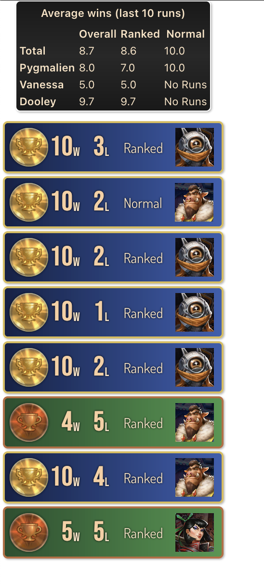

# Bazaar Run History - Stream Overlay

This is an integration with Bazaar Insights which parses your recent runs and serves a website to display them as an overlay. You can use this with OBS by using a Browser Source.

Currently, this code works, but has a few issues:

- allorigins.win is used to proxy the request to Bazaar Insights due to BI not having CORS enabled. This is often fairly slow.
- You must manually refresh the page to get new data
- The endpoint this uses is approved by the creator of Bazaar Insights, but will soon be deprecated in favor of a local endpoint. This will require some rewriting of this code, so keep in mind that this will not work as a long-term solution.

## How to run this code

You can run the server locally using `yarn start` then open `localhost:3000/?name=<YOUR_GAMERTAG>` with your URL parameters

## URL Parameters

name: string | null; // gamerTag
useResultStyles: boolean;
maxRuns: number;
showRunStats: boolean;

## Example

